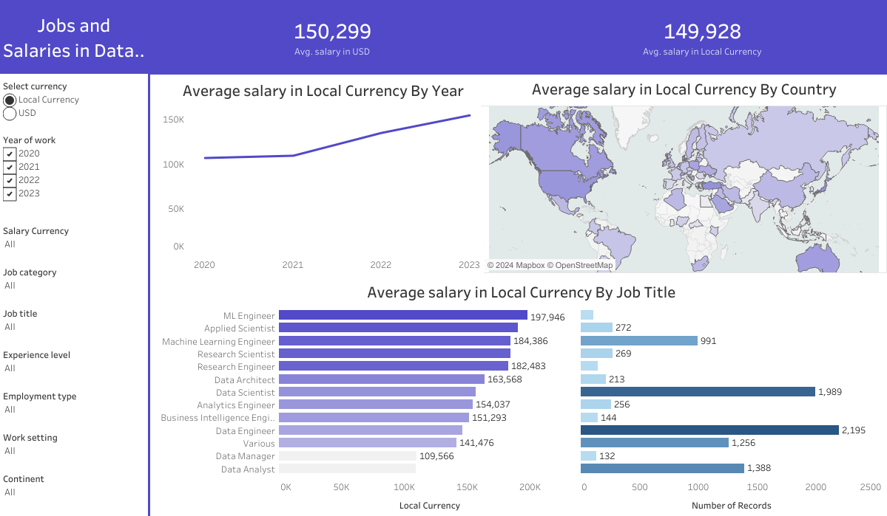
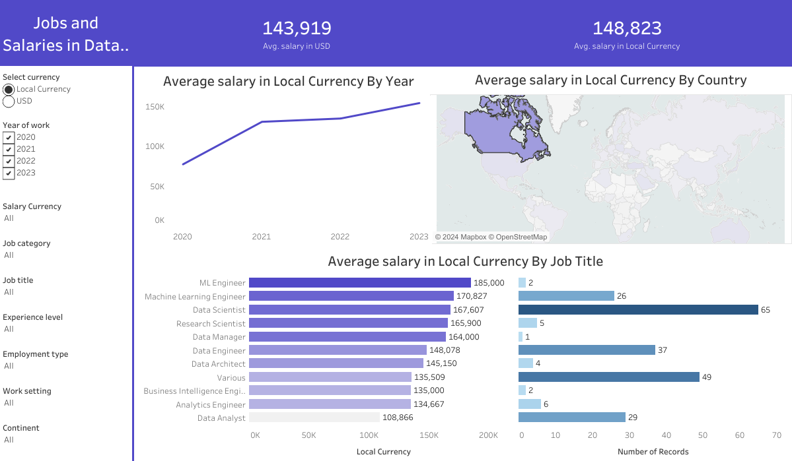
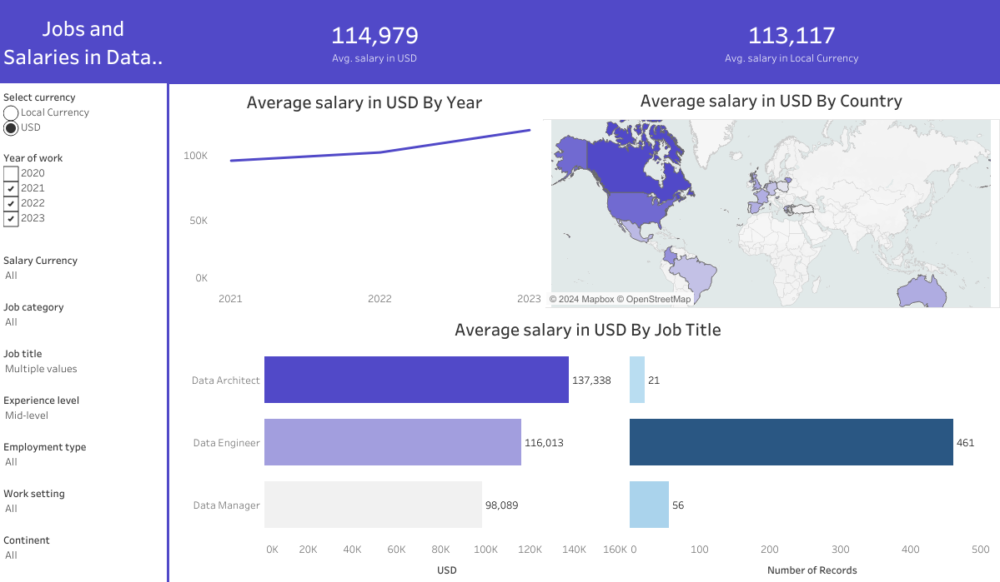

# Jobs and Salaries in Data Science Dashboard

This repository contains the Tableau Public dashboard "Jobs and Salaries in Data Science visualisation" The dashboard provides a comprehensive overview of the data science job market, offering insights into salaries and job trends across different dimensions. The visualization helps users understand how salaries vary by country, job title, experience level, and other relevant factors.

The Tableau file containing the dashboard is named `jobs_salary_data_science.twb`.

[Link to Tableau Public project](https://public.tableau.com/app/profile/miko.aj.ko.ek/viz/Book1_17216428564260/Dashboard1)

## Dashboard Overview

### Global Salary Map
- **Overview**: Highlights the average salaries for data science jobs in different countries around the world.
- **Purpose**: Aids in comparing salary ranges globally, helping users identify which countries offer the highest compensation for data science roles.
- **Usage**: Hover over a country to see detailed information about the average salary in that region. The map can be filtered to show salaries in different currencies.

### Average Salary Over Time Line Chart
- **Overview**: Displays the average salary for data science jobs over the years.
- **Purpose**: Provides a temporal view of salary trends, helping users identify how the average compensation has changed over time.
- **Usage**: Use filters to narrow down the data by specific years, experience levels, or job titles to see how these factors influence salary trends.

### Salary and Job Title Analysis Bar Chart
- **Overview**: Shows the average salary and the number of job records for each job title in the data science field.
- **Purpose**: Helps users understand which job titles are most prevalent and how they compare in terms of compensation.
- **Usage**: The graph can be filtered by job category, experience level, employment type, and work setting to see how these dimensions impact salaries and job availability.

## Interactive Filters
- **Select Currency**: Convert the salary data to USD or local currency.
- **Year of Work**: Focus on specific years to see how salaries and job distributions have evolved.
- **Salary Currency**: Filter data based on the currency in which salaries are reported.
- **Job Category**: Narrow down the data to specific categories within data science (e.g., Data Analysis, Data Engineering, Machine Learning and AI).
- **Job Title**: Focus on particular job titles to see detailed salary and job record information.
- **Experience Level**: Filter by experience level (e.g., Entry-level, Mid-level, Senior) to understand how experience impacts salary.
- **Employment Type**: Filter by Contract, Freelance, Full-time, or Part-time positions to see how employment type affects compensation.
- **Work Setting**: Compare salaries between different work settings, such as Remote work, In-person, or Hybrid models.
- **Continent**: Narrow down the analysis to specific continents for a more localized view of the data science job market.

## How to Use This Dashboard
1. **Start with the Global Salary Map** to get a broad understanding of where the highest-paying data science jobs are located globally.
2. **Explore the Average Salary Over Time Graph** to see how data science salaries have changed over the years.
3. **Dive into the Salary and Job Title Analysis Graph** to compare different job titles and understand the market demand and salary ranges for each.
4. **Utilize the Filters** to customize the dashboard to your specific needs and interests, whether you're looking for data based on a particular currency, job category, or region.
